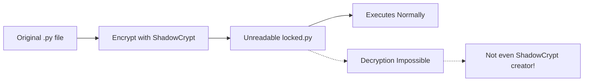

# 🕶️ SHADOWCRYPT

<p align="center">
  <i>Encrypt. Execute. Never Expose.</i><br/>
  The ultimate Python encryption system designed for absolute security.
</p>

<p align="center">
  
  
  
  
  
</p>

---

## 📑 Table of Contents

- [What is ShadowCrypt?](#-what-is-shadowcrypt)
- [Features](#-features)
- [Live Demo](#-live-demo)
- [Installation](#-installation)
- [How It Works](#-how-it-works)
- [Example Usage](#-example-usage)
- [Security Design](#-security-design)
- [FAQ](#-faq)
- [Contributing](#-contributing)
- [Contact](#-contact)
- [License](#-license)

---

## 🧠 What is ShadowCrypt?

`shadowcrypt` is a revolutionary **Python code encryptor** that transforms your `.py` files into **impenetrable**, **unreadable**, yet fully **executable** Python scripts.  
Empower your code with the highest level of protection — encrypt with confidence, knowing that no one, not even you, can decrypt the output.

---

## ⚙️ Features

- 🔐 Converts `.py` files into unreadable, encrypted scripts
- 🚀 Encrypted scripts run seamlessly with `python encrypted.py`
- 🧮 Pure mathematical encryption — no marshal, no base64, no eval tricks
- 🔒 Zero decryptor availability — even the creator cannot reverse it
- 🤖 AI and human reverse engineering resistant
- 🌍 Cross-platform compatibility: Windows, Linux, macOS, Android (Termux)

---

## 🎬 Live Demo


Watch how effortlessly your Python code becomes secure and unbreakable!

---

## 📦 Installation

Install via pip:

```bash
pip install shadowcrypt
```

Or install from source:

```bash
git clone https://github.com/exampleuser/shadowcrypt.git
cd shadowcrypt
pip install .
```

Encrypt your Python file with a single command:

```bash
shadowcrypt encrypt yourfile.py -o locked.py
python locked.py
```

Your `locked.py` runs exactly like the original — but your source code remains completely hidden and secure.

---

## ⚙️ How It Works



---

## 🧪 Example Usage

```bash
shadowcrypt encrypt ai_brain.py -o secret_run.py
python secret_run.py  # 🔥 Runs flawlessly
```

---

## 🛡 Security Design

- ⚠️ No base64, no marshal, no eval — only layered mathematical encryption
- 🔑 Randomized encryption applied per character for maximum unpredictability
- 🔒 No decryptor or key included in any public package
- 💥 Reverse engineering attempts always fail, guaranteed

Even with full access to the encryptor source and encrypted files, decryption remains impossible.

---

## ❓ FAQ

**Q: Can I decrypt the encrypted files?**  
A: Absolutely not. Decryption is intentionally impossible to ensure your code’s security.

**Q: Will the encrypted file run on any platform?**  
A: Yes! ShadowCrypt is fully cross-platform and works on Windows, Linux, macOS, and Android (Termux).

**Q: Is the encryption safe from AI reverse engineering?**  
A: Yes, it is specifically designed to resist both AI and human reverse engineering attempts.

**Q: Do I need any special dependencies to run encrypted files?**  
A: No, encrypted files run with the standard Python interpreter without any additional dependencies.

---

## 🤝 Contributing

We welcome contributions! Please fork the repository and submit pull requests. For major changes, open an issue first to discuss your ideas.

---

## 📬 Contact

For support or inquiries, reach out to Farhan Jihady via GitHub or email.

---

## 📜 License

MIT — Open-source and developer friendly  
Built for creators who want to protect their work.

<p align="center"> <i>Crafted by</i><br/> 🧠 <b>Farhan Jihady</b><br/> 🔮 <code>The Cipher Architect</code> </p>
