<h1 align="center">
  
</h1>

<p align="center">
  
  
  
  
  
  
</p>

---

## 💣 What is ShadowCrypt?

> ShadowCrypt is the most extreme Python encryptor ever built.
> - Turns `.py` files into **unreadable** but **runnable** scripts.
> - No one can decrypt — **not even you**.
> - AI & reverse engineers fail. Every time.

---

## ⚙️ How It Works

```mermaid
graph TD
    A[Original .py file] --> B[Encrypt with ShadowCrypt 🔐]
    B --> C[🔒 Unreadable locked.py]
    C --> D[🧠 Executes Normally]
    C -. 🚫 Decryption Not Possible .-> X[❌ Not even ShadowCrypt creator!]
```



---

## 🧠 Features

| Feature                             | Status     |
|------------------------------------|------------|
| Encrypts readable `.py` files      | ✅ Yes     |
| Output is still executable         | ✅ Yes     |
| Decryption possible?               | ❌ Never   |
| AI & LLM decoding resistance       | ✅ Yes     |
| Human reverse-proof                | ✅ Yes     |
| Cross-platform (Win/Linux/Android) | ✅ Yes     |

---

## 📦 Installation

```bash
pip install shadowcrypt
```

or from source:

```bash
git clone https://github.com/YOUR_USERNAME/shadowcrypt.git
cd shadowcrypt
pip install .
```

---

## 🔐 Encrypt Your File

```bash
shadowcrypt encrypt yourcode.py -o locked.py
python locked.py
```

➡️ Still runs.  
🚫 Cannot be reversed.  
✅ Remains yours.

---

## 💻 Terminal Simulation

```bash
> shadowcrypt encrypt ai_model.py -o brain.py
> python brain.py
🔐 Encrypting with advanced math...
✅ Saved to brain.py
💥 Launching encrypted code...
👁️ Source Visibility: ZERO
```

---

## 🧬 Execution Preview

<div align="center">
  
</div>

---

## 👤 Developer Identity

<div align="center">
  
</div>

---

## 🛡️ Security Design

- 🔐 Pure math logic (no marshal, base64, eval)
- 💣 Randomized characters with trigonometric transformations
- 🔥 No decryptor in package — only encryption
- 🧠 Reverse engineering = impossible

> ShadowCrypt is not obfuscation — it’s mathematical exile.

---

## 📜 License

MIT — Free to use.  
Impossible to decrypt.
